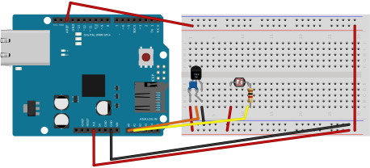

# Arduino IoT device

A simple Arduino UNO sketch is provided in the `arduino/tempLightSensor` folder.
The sketch reads temperature and light from sensors. 

The simple schematic is:



The sketch does require an Ethernet shield and a bunch of libraries which are
available as git submodules under `arduino/libraries`.

```bash
git submodule update --init
```

Be advised that some libraries (notably the `NTP` one) have been customized.

An `ESP32` board (or similar Arduino) may be used, with some adaptions, too.

## EEPROM

Configuration parameters are stored and retrieved from the `EEPROM`.
An helper sketch to update the `EEPROM` is available under
`arduino/eeprom_prog`.

The data stored in the `EEPROM` is:

```c
// Ethernet MAC address
const byte mac[6];

// Device serial number
const char serial[];

// IoT platform address and port
struct netConfig {
  IPAddress address;
  unsigned int port;
};

```

The `EEPROM` can be completely erased setting the `ERASE_FIRST` macro to `1`.

```c
#define ERASE_FIRST 0
```

## Firmware options

The following macros are available in the firmware (to be set at compile time):

```c
#define DEBUG_TO_SERIAL   0   // debug on serial port
#define USE_MQTT          1   // use mqtt protocol instead of http post
#define USE_INTERNAL_NTP  1   // use default ntp server or the internal one
#define TELEMETRY_DELAY  10   // second between telemetry samples
#define AREF_VOLTAGE      3.3 // set aref voltage to 3.3v instead of default 5v
```